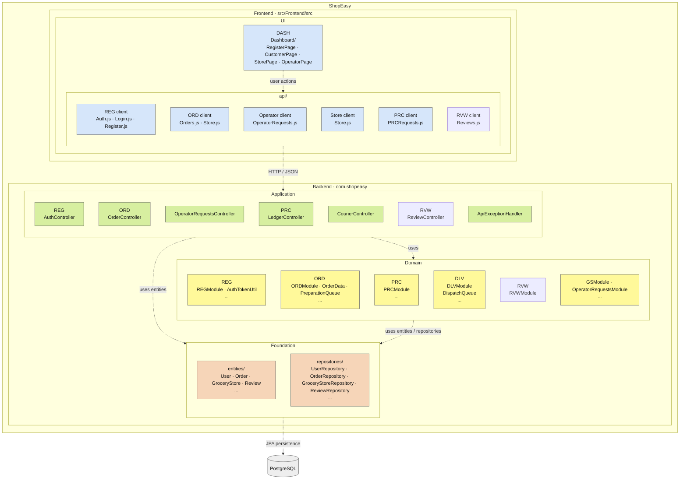

# ShopEasy Package Diagram

```mermaid
flowchart TB
    subgraph system["ShopEasy"]
        direction TB

        subgraph frontend["Frontend · src/Frontend/src"]
            direction TB

            subgraph dashModule["UI"]
                direction TB
                dashboard["DASH<br/>Dashboard/<br/>RegisterPage · CustomerPage · StorePage · OperatorPage"]
                subgraph api["api/"]
                    direction TB
                    regClient["REG client<br/>Auth.js · Login.js · Register.js"]
                    ordClient["ORD client<br/>Orders.js · Store.js"]
                    operatorClient["Operator client<br/>OperatorRequests.js"]
                    storeClient["Store client<br/>Store.js"]
                    prcClient["PRC client<br/>PRCRequests.js"]
                    rvwClient["RVW client<br/>Reviews.js"]
                end
                dashboard -. "user actions" .-> api
            end

        end

        subgraph backend["Backend · com.shopeasy"]
            direction TB

            subgraph application["Application"]
                direction TB
                authController["REG<br/>AuthController"]
                orderController["ORD<br/>OrderController"]
                operatorController["OperatorRequestsController"]
                prcController["PRC<br/>LedgerController"]
                courierController["CourierController"]
                rvwController["RVW<br/>ReviewController"]
                exceptionHandler["ApiExceptionHandler"]
            end

            subgraph domain["Domain"]
                direction TB
                reg["REG <br/>REGModule · AuthTokenUtil<br/>..."]
                ord["ORD <br/>ORDModule · OrderData · PreparationQueue<br/>..."]
                prc["PRC <br/>PRCModule<br/>..."]
                dlv["DLV <br/>DLVModule<br/>DispatchQueue<br/>..."]
                rvw["RVW <br/>RVWModule"]
                supporting["GSModule · OperatorRequestsModule<br/>..."]
            end

            subgraph foundation["Foundation"]
                direction TB
                entities["entities/<br/>User · Order · GroceryStore · Review<br/>..."]
                repositories["repositories/<br/>UserRepository · OrderRepository · GroceryStoreRepository · ReviewRepository<br/>..."]
            end


            application -. "uses" .-> domain
            application -. "uses entities" .-> foundation
            domain -. "uses entities / repositories" .-> foundation
        end

        api -. "HTTP / JSON" .-> application
    end

    database[("PostgreSQL")]
    foundation -. "JPA persistence" .-> database

    classDef uiStyle fill:#d6e6fa,stroke:#555,color:#111
    classDef appStyle fill:#d7efa0,stroke:#555,color:#111
    classDef domainStyle fill:#fff99a,stroke:#555,color:#111
    classDef foundationStyle fill:#f6d5b8,stroke:#555,color:#111
    classDef databaseStyle fill:#eeeeee,stroke:#555,color:#111
    class dashboard,regClient,ordClient,operatorClient,storeClient,prcClient uiStyle
    class authController,orderController,operatorController,prcController,exceptionHandler,courierController appStyle
    class reg,ord,prc,supporting,dlv domainStyle
    class entities,repositories foundationStyle
    class database databaseStyle
```
